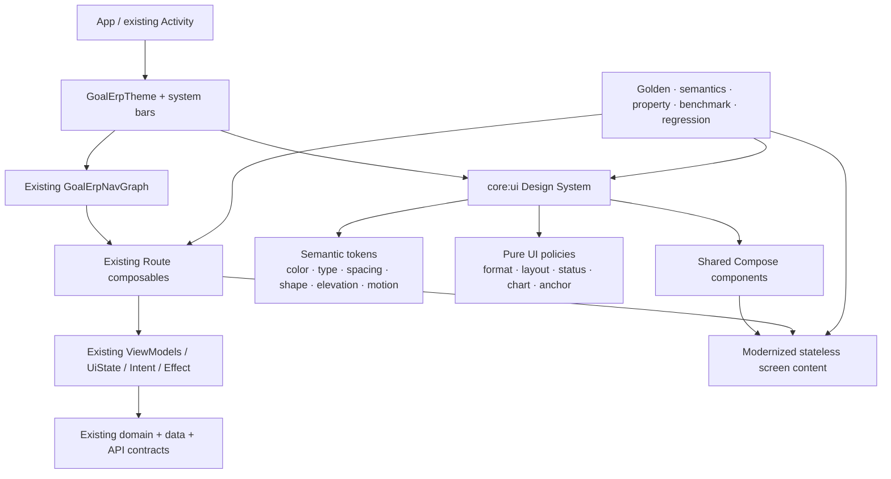
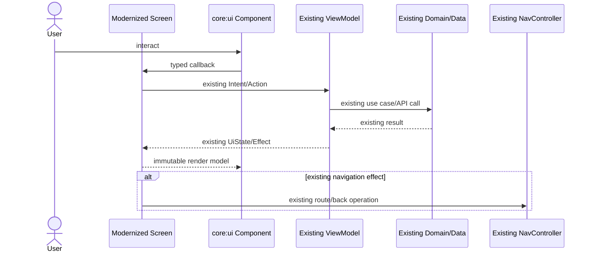
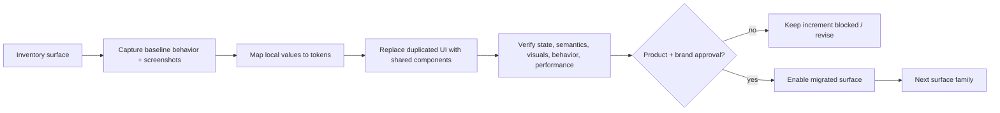
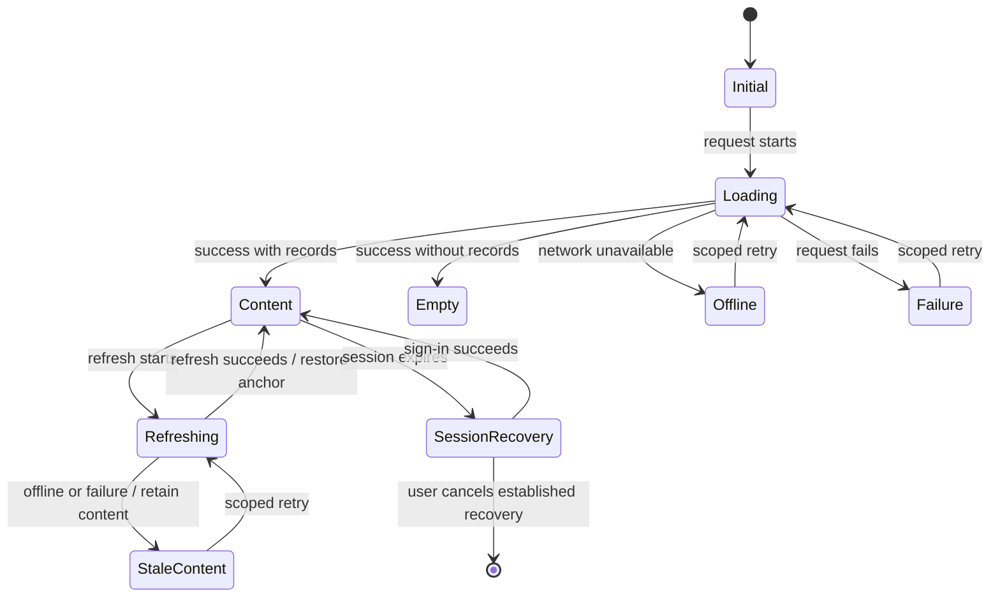

# Design Document: Distinctive UI Modernization

## Overview

This design modernizes LubricantERP's presentation layer without changing its business behavior. It introduces a Material 3-aligned design system in `core:ui`, then migrates `feature_reports:presentation` surface by surface while retaining the existing MVI contracts, reducers/view models, Koin construction, domain/data modules, API contracts, permissions, route identifiers, back-stack behavior, and submitted values.

The result is a premium but operationally restrained ERP interface: confident violet establishes brand recognition, deep lubricant green communicates secondary emphasis, neutral surfaces support dense data, and fluid/tank-inspired details add industry character only where they cannot obscure content or alter standard Android interaction. “Premium” means precise hierarchy, consistent spacing, high-quality states, stable motion, and excellent legibility—not ornamental animation or novel controls.

### Goals

- Build one app-wide, semantic Compose design foundation for light and dark themes.
- Make authentication, dashboard, report discovery/detail, customers, payments, orders, products, cost breakdowns, invoices, notifications, settings, forms, modals, and navigation visually coherent.
- Preserve every existing `UiState`/intent/effect and navigation outcome; modernization is a rendering and interaction-quality change, not a domain rewrite.
- Support 320–1200 dp windows, 200% font scale, system insets, IME, non-touch focus, accessibility services, and reduced motion.
- Standardize financial, quantity, date, status, chart, table, list, form, state, and feedback presentation.
- Roll out in measured increments with visual approval and explicit release gates.

### Non-goals

- Replacing the existing logo, inventing a typeface, changing the provisional violet/green direction, or introducing unapproved illustrations.
- Changing calculations, validation acceptance, data precision, API request/response interpretation, role checks, destinations, Koin modules, MVI state transitions, or storage behavior.
- Rewriting all screens at once or replacing Navigation Compose.
- Treating dynamic color as a brand source. System dynamic colors are not enabled because they could replace the approved provisional brand identity; system light/dark selection remains supported.

### Explicit assumptions and unresolved brand choices

1. Existing `ic_logo`/Goal ERP assets and the current violet (`BrandPrimary`) and green (`BrandSecondary`) direction remain provisional production inputs.
2. The exact final primary/secondary tonal values, logo clear-space rules, and any custom typeface require brand approval. The token architecture isolates these decisions so values can change without surface rewrites.
3. Industry cues use code-drawn, nonessential fluid contours, tank gauges, fill lines, and subtle industrial grid geometry. No new photographic, illustrative, or trademark asset is assumed.
4. The product name exposed to accessibility is **“LubricantERP”**, even where a visible legacy label still reads “Goal ERP”; visible renaming is deferred to product/brand approval.
5. The existing `ThemeMode.SYSTEM/LIGHT/DARK` setting remains authoritative.

### Existing codebase findings

The design is grounded in the inspected repository rather than a greenfield model:

- `core/ui/theme/{Color,Theme,Type}.kt` already owns a Material 3 theme, violet/green colors, three shape values, and system dark-mode support. It lacks complete semantic/status/chart roles and a fourth modal shape.
- `core/ui/components` contains `GoalCards`, `StatusPlaceholders`, shimmer components, `NetworkStatusBar`, effect helpers, and `ThemeRevealTransitionBus`, but many patterns remain duplicated in feature files.
- `LoginScreen.kt` already uses persistent labels, IME padding, password visibility, loading state, and decorative gradients, but its decorations and motion need tokenization, accessibility cleanup, and reduced-motion policy.
- `HomeTabScreen.kt`, `ReportsTabScreen.kt`, and `PremiumBottomBar.kt` contain rich cards and gradients, but hard-coded colors, duplicate grid code, invisible ripple removal, and continuously repeating animation make the experience inconsistent.
- `SalesReportScreen.kt`, `ReportModuleScreen.kt`, `ProductsScreen.kt`, and `CustomerDataScreen.kt` implement filtering, sorting, tabular rows, bottom sheets, loading/error/offline paths, and stable list keys. These provide behavior to preserve while shared report/list primitives replace local styling.
- `CreateCostBreakdownScreen.kt` is a representative complex form with dependent selectors, field errors, derived read-only values, pending submission, record actions, and a modal editor. It is the form pilot.
- `TankStockSummaryScreen.kt` has a custom `Canvas` tank visualization; `ConsolidatedStockScreen.kt` has the strongest existing row semantics. Both inform the chart/accessibility API.
- `AppNavGraph.kt` centralizes routes and animated transitions. The route graph remains unchanged; only navigation chrome and transition policy are adapted.
- Unit tests exist for common/network/data behavior and a shared theme transition bus, but Compose UI, screenshot, accessibility, macrobenchmark, and property-test infrastructure are not yet configured.

### Research findings informing the design

- Android guidance recommends layouts responsive to the **current app window**, including resizable and multi-window configurations, rather than assumptions about device type. It also provides adaptive bar/rail navigation and canonical list-detail/supporting-pane patterns: [support different display sizes](https://developer.android.com/develop/adaptive-apps/guides/support-different-display-sizes), [adaptive navigation](https://developer.android.com/develop/adaptive-apps/guides/build-adaptive-navigation), and [list-detail layouts](https://developer.android.com/develop/adaptive-apps/guides/list-detail).
- Material 3 color, typography, and shape subsystems can be extended with a custom design-system layer while retaining Material components: [Material 3 in Compose](https://developer.android.com/develop/ui/compose/designsystems/material3) and [custom design systems](https://developer.android.com/develop/ui/compose/designsystems/custom).
- Compose accessibility requires deliberate semantics merging/traversal, at least 48 dp interactive targets, automation plus manual service testing, and protected insets: [semantics merging](https://developer.android.com/develop/ui/compose/accessibility/merging-clearing), [traversal order](https://developer.android.com/develop/ui/compose/accessibility/traversal), [API defaults](https://developer.android.com/develop/ui/compose/accessibility/api-defaults), [accessibility testing](https://developer.android.com/develop/ui/compose/accessibility/testing), and [window insets](https://developer.android.com/develop/ui/compose/system/insets).
- Compose exposes the system animation duration scale; a zero scale completes motion immediately, which supports the reduced-motion policy: [MotionDurationScale](https://developer.android.com/reference/kotlin/androidx/compose/ui/MotionDurationScale).
- Official guidance recommends screenshot testing for Compose visual attributes, while Macrobenchmark measures larger workflows and frame timing: [Compose screenshot testing](https://developer.android.com/training/testing/ui-tests/screenshot) and [Macrobenchmark](https://developer.android.com/topic/performance/benchmarking/macrobenchmark-overview).
- Kotest supplies Kotlin property generators, shrinking, and configurable iteration counts suitable for the pure presentation-policy layer: [Kotest property tests](https://kotest.io/docs/proptest/property-test-functions.html).

Content was rephrased for compliance with licensing restrictions.

## Architecture

### Architectural principles

1. **Presentation-only migration:** Existing route composables continue collecting the same state and emitting the same actions. Modernized screen content is stateless wherever practical.
2. **Semantic tokens before components:** Feature code asks for `status.warning`, `spacing.md`, or `motion.emphasized`, never hard-coded orange, 16 dp, or 300 ms.
3. **Policy as pure Kotlin:** Formatting, responsive pane choice, status mapping, chart normalization, anchor restoration, motion selection, and state precedence are deterministic functions that can be property-tested without Android runtime.
4. **Material behavior, distinctive skin:** Material app bars, fields, buttons, dialogs, sheets, tabs, navigation, focus, and feedback remain recognizable. Brand details live in containers, accent geometry, chart styling, and data hierarchy.
5. **State hoisting and stable identity:** Screen state stays in existing MVI view models and saveable/navigation state. Shared components accept immutable models and callbacks; they do not fetch data or construct Koin dependencies.
6. **Accessibility is part of each contract:** Components require meaningful labels/status text rather than relying on callers to patch semantics afterward.
7. **Incremental compatibility:** Legacy and modernized surfaces share the same root `GoalErpTheme`; no parallel app shell or duplicate route graph is introduced.

### Layered architecture



### Runtime data and action flow



No shared component calls a repository, resolves Koin, changes permissions, or creates a new navigation destination.

### Target package ownership

| Ownership | Responsibility | Existing foundation / planned addition |
|---|---|---|
| `core:ui/theme` | Root Material theme and semantic token families | Extend `Color.kt`, `Theme.kt`, `Type.kt`; logically add spacing/elevation/motion/brand token definitions during implementation |
| `core:ui/components` | Buttons, fields, status, state, cards, app bars, filters, responsive tables, charts, dialogs, navigation chrome | Consolidate existing `GoalCards`, placeholders, shimmer, network bar; add typed shared APIs |
| `core:ui/policy` (logical package) | Pure formatting, status, layout, anchor, motion, and chart functions | New pure Kotlin policy layer; no Android I/O |
| `feature_reports:presentation/*Route` | Collect state/effects, resolve Koin view model, dispatch existing actions, invoke navigation callbacks | Retained |
| `feature_reports:presentation/*Screen` | Map existing state to shared render models and arrange feature-specific content | Migrated incrementally |
| Existing domain/data/core modules | Business calculations, validation, API, storage, authorization | Unchanged |

### Incremental migration architecture

Each migration increment follows a strangler pattern inside the current app shell:



A compile-time surface implementation choice or release-controlled feature flag may select legacy versus modernized content at the route boundary, but both variants consume the same state and callbacks. The flag must never alter business or permission logic. Once an increment is accepted, the legacy renderer is removed to avoid permanent dual maintenance.

### Visual direction: “Precision in Flow”

The visual language combines industrial reliability with controlled fluidity:

- **Precision:** strong typographic alignment, tabular numerals, explicit units, low-noise separators, stable grids, and clear operational statuses.
- **Flow:** restrained curved highlight bands, liquid-level progress, tank silhouettes, and soft gradient accents that imply lubricant movement without simulating it continuously.
- **Trust:** neutral data surfaces dominate; violet is reserved for identity and primary action, green for approved secondary/success meaning, and semantic warning/error colors remain unambiguous.
- **Distinctiveness:** login, dashboard, report discovery/detail, and forms receive at least two safe cues: logo/brand title plus a fluid contour, tank/fill motif, violet-green accent line, or industrial data pattern. Cues are decorative, excluded from semantics, contrast-checked, and omitted under constrained geometry.
- **Restraint:** no glassmorphism over data, no low-contrast translucent text, no bounce on consequential actions, no perpetual sloshing/shimmer after five seconds, and no color-only status.

### Theme and semantic color system

`GoalErpTheme` remains the root API and selects fixed brand light/dark schemes based on the existing theme mode. The implementation completes all Material roles (`background`, all surface containers, outline, inverse, error, tertiary) and exposes additional semantic roles through a stable `GoalErpColors` composition local.

The values below are **role intent**, not final unapproved color constants. Candidate tonal values must pass automated contrast checks before approval.

| Semantic role | Light intent | Dark intent | Usage |
|---|---|---|---|
| `brandPrimary` | deep violet on light neutral | lighter violet tone on near-black neutral | primary action, selected state, key focus |
| `brandSecondary` | deep lubricant green | lighter green | secondary action, approved/success-adjacent accent |
| `brandAccent` | violet-green transitional accent | reduced-luminance equivalent | decorative lines and selected data emphasis only |
| `surfaceBase` | cool near-white | graphite/ink | app background |
| `surfaceRaised` | white/cool gray | lifted graphite | cards, menus, sheets |
| `surfaceSunken` | pale cool gray | deep ink | grouped data, table headers |
| `contentPrimary` | near-black | near-white | titles and values |
| `contentSecondary` | dark slate | light slate | labels and metadata |
| `success` / `onSuccess` | contrast-approved green pair | contrast-approved green pair | completed, paid, available |
| `warning` / `onWarning` | contrast-approved amber/brown pair | contrast-approved amber pair | pending, low stock, stale |
| `info` / `onInfo` | contrast-approved blue pair | contrast-approved blue pair | neutral operational information |
| `error` / `onError` | Material error pair | Material error pair | failed, overdue, destructive |
| `focus` | high-contrast violet/black fallback | high-contrast light violet/white fallback | 2 dp focus ring |
| `chart1..chart8` | separable tones plus shape/pattern | theme-equivalent tones plus shape/pattern | series only; never sole meaning |

Every status resolver returns color roles **and** text/icon semantics. Provisional colors that fail 4.5:1 normal-text, 3:1 large-text, or 3:1 non-text requirements are replaced by compliant tonal variants for that role. Decorative roles have no content-bearing responsibility and can be removed.

### Typography roles

The existing platform sans-serif remains until a typeface is approved. Material typography is extended with ERP roles:

| Role | Base style | Rules |
|---|---|---|
| Display | 36–57 sp, regular | nonessential brand display only |
| Headline | 24–32 sp, semibold | surface purpose and large KPI group headings |
| Title | 16–22 sp, medium/semibold | app bars, cards, content regions |
| Body | 14–16 sp, regular | body content; never below 14 sp for task content |
| Label | 12–14 sp, medium | controls and metadata; control labels remain readable at 200% |
| `financialValue` | title/headline, semibold, tabular figures | explicit currency, right alignment in comparisons |
| `tabularNumeric` | body/label, medium, tabular figures | decimal alignment and stable column widths |
| `statusLabel` | 12–14 sp, semibold | never color-only; allows wrapping |

Text uses scalable `sp`, no forced one-line clipping for task-critical labels/statuses, and a maximum readable body line of 80 characters on wide windows. Decorative typography is never needed to complete a workflow.

### Spacing, shape, elevation, icon, and motion roles

**Spacing scale:** `0, 4, 8, 12, 16, 20, 24, 32, 40, 48, 64 dp`, exposed as named roles (`none`, `xxs`…`xxl`, `touch`). Feature code does not introduce arbitrary layout constants without a documented exception.

**Exactly four primary shape roles:**

1. `control = 12.dp` — buttons, fields, chips.
2. `card = 16.dp` — list and KPI cards.
3. `container = 20.dp` — content regions and feature panels.
4. `modal = 28.dp` top/full or all corners as appropriate — dialogs and sheets.

Circular avatars and 50% pills are secondary geometry, not additional primary corner roles.

**Elevation roles:** `flat=0`, `resting=1`, `raised=3`, `overlay=6`, `modal=12 dp`. Borders, tonal surfaces, and whitespace establish most hierarchy; shadows are not stacked. Pressed elevation never creates layout movement.

**Icons:** Material icons are authoritative for back, close, search, filter, refresh, edit, delete, settings, visibility, logout, and common navigation. Unknown/custom icons require adjacent visible text. Record-scoped icon-only actions receive labels such as “Edit raw material RM-104”. Decorative icons use `contentDescription = null`.

**Motion roles:**

| Role | Normal | Reduced motion |
|---|---:|---:|
| Immediate acknowledgement | ripple/state layer ≤100 ms | immediate state layer |
| Fast state | 120–150 ms | 0–100 ms cross-fade |
| Standard | 200–300 ms | 100–150 ms cross-fade |
| Emphasized transition | 300–450 ms | ≤150 ms cross-fade |
| Loading | bounded progress or skeleton after 300 ms | static skeleton/bounded progress |

The design-system motion policy reads `MotionDurationScale`. Zero duration, an app/test reduced-motion override, or an accessibility-derived reduced-motion state disables spatial translation, scale pulses, count-up animation, liquid waves, staggered reveals, and repeated shimmer. Essential state changes remain immediate or use a ≤150 ms fade. Repeating decoration automatically stops by five seconds.

### Adaptive window strategy

A pure `WindowLayoutPolicy` maps the **available app width** to the approved boundaries:

- Compact: `<600 dp`
- Medium: `600..<840 dp`
- Large: `>=840 dp`
- Tested overall range: `320..1200 dp`

Height, IME visibility, and fold/inset constraints can force a simpler arrangement. Width changes only alter composition; they never dispatch submit/cancel/load intents.

| Pattern | Compact | Medium | Large |
|---|---|---|---|
| Top-level navigation | labeled bottom bar | labeled rail when ergonomically valid; otherwise bar | labeled rail; drawer only if destination count later requires it |
| Dashboard | one column or two compact KPI cells | two-column regions | 12-column grid with bounded content width |
| Report list/detail | one pane with existing navigation | list plus selected detail where state permits | list-detail/supporting pane |
| Forms | single column, sticky action region where safe | two-column related fields | form + read-only summary/supporting pane |
| Tables | readable record rows/expandable detail | priority columns + expandable remainder | full table with sticky header where practical |
| Modals | full-width sheet/dialog with scroll | bounded sheet/dialog | bounded dialog or supporting pane |

State ownership remains outside adaptive branches. `rememberSaveable`, existing view-model state, stable item keys, `LazyListState.Saver`, and navigation saved state preserve entered values, errors, selection, expansion, filters, pending operation flags, and the nearest visible item. `safeDrawingPadding`, `navigationBarsPadding`, and `imePadding` are applied once at the owning scaffold/content boundary to avoid double consumption.

## Components and Interfaces

### Theme and token API

```kotlin
@Immutable
data class GoalErpColors(
    val success: Color,
    val onSuccess: Color,
    val successContainer: Color,
    val onSuccessContainer: Color,
    val warning: Color,
    val onWarning: Color,
    val warningContainer: Color,
    val onWarningContainer: Color,
    val info: Color,
    val onInfo: Color,
    val focusIndicator: Color,
    val chartSeries: List<Color>,
    val decorativeFluidStart: Color,
    val decorativeFluidEnd: Color,
)

@Immutable
data class GoalErpSpacing(
    val xxs: Dp = 4.dp,
    val xs: Dp = 8.dp,
    val sm: Dp = 12.dp,
    val md: Dp = 16.dp,
    val lg: Dp = 24.dp,
    val xl: Dp = 32.dp,
    val touch: Dp = 48.dp,
)

@Composable
fun GoalErpTheme(
    darkTheme: Boolean = isSystemInDarkTheme(),
    motionOverride: MotionPreference? = null,
    content: @Composable () -> Unit,
)
```

`GoalErpTheme` supplies Material `colorScheme`, `typography`, and four shape roles, plus immutable composition locals for spacing, elevation, semantic colors, and motion. Components use Material primitives internally so ripple, focus, disabled, pressed, and accessibility behavior are inherited rather than rebuilt with raw `pointerInput`.

### Action, status, and content-region components

```kotlin
enum class ActionEmphasis { Primary, Secondary, Tertiary, Destructive }
enum class BusinessStatus { Paid, Overdue, Pending, LowStock, Available, Failed, Completed, Inactive, Stale, Unknown }

@Immutable
data class StatusPresentation(
    val label: String,
    val icon: ImageVector?,
    val foreground: Color,
    val container: Color,
    val accessibilityDescription: String = label,
)

@Composable
fun GoalActionButton(
    label: String,
    onClick: () -> Unit,
    modifier: Modifier = Modifier,
    emphasis: ActionEmphasis = ActionEmphasis.Primary,
    enabled: Boolean = true,
    pending: Boolean = false,
    icon: ImageVector? = null,
)

@Composable
fun BusinessStatusBadge(
    status: BusinessStatus,
    modifier: Modifier = Modifier,
    supportingText: String? = null,
)

@Composable
fun ContentRegion(
    title: String,
    modifier: Modifier = Modifier,
    supportingText: String? = null,
    primaryAction: (@Composable () -> Unit)? = null,
    content: @Composable ColumnScope.() -> Unit,
)
```

`ContentRegion` sets a heading semantic, `isTraversalGroup`, logical order, and one primary-action slot. Decorative containers are optional; grouping can be expressed by spacing/dividers.

State precedence is deterministic: `Disabled > Loading > Error > Selected > Focused > Pressed > Default` for visual treatment, while semantics expose all applicable meanings (for example “Selected, loading, unavailable”). Pressed acknowledgement remains visible even when selected.

### State presentation

```kotlin
sealed interface RegionState<out T> {
    data object Initial : RegionState<Nothing>
    data class Loading<T>(val previous: T? = null, val operation: String) : RegionState<T>
    data class Content<T>(val value: T, val stale: Boolean = false) : RegionState<T>
    data class Empty(val datasetName: String, val filterSummary: String? = null) : RegionState<Nothing>
    data class Offline<T>(val previous: T?, val operation: String) : RegionState<T>
    data class Failure<T>(
        val previous: T?,
        val operation: String,
        val retryable: Boolean,
        val reason: String,
    ) : RegionState<T>
}

@Composable
fun <T> RegionStateHost(
    state: RegionState<T>,
    loadingDelayMillis: Long = 300,
    onRetry: (() -> Unit)? = null,
    onResetFilters: (() -> Unit)? = null,
    content: @Composable (T) -> Unit,
)
```

This is a presentation adapter, not a replacement for existing UI state. Feature mappers derive a `RegionState` from existing flags. Persistent content remains rendered beneath a nonblocking refresh/offline/error banner; retry callbacks dispatch existing intents. Initial loading uses a structure-matched skeleton after 300 ms. Empty, offline, and error remain mutually distinguishable, operation-specific, and accessibility-announced.

### Forms

```kotlin
@Immutable
data class FieldPresentation(
    val id: String,
    val label: String,
    val value: String,
    val required: Boolean,
    val readOnly: Boolean = false,
    val enabled: Boolean = true,
    val error: String? = null,
    val supportingText: String? = null,
)

@Composable
fun GoalTextField(
    field: FieldPresentation,
    onValueChange: (String) -> Unit,
    modifier: Modifier = Modifier,
    keyboardOptions: KeyboardOptions = KeyboardOptions.Default,
    keyboardActions: KeyboardActions = KeyboardActions.Default,
    leadingIcon: ImageVector? = null,
    trailingAction: FieldTrailingAction? = null,
)

@Composable
fun <T> GoalSelectField(
    field: FieldPresentation,
    options: List<T>,
    optionLabel: (T) -> String,
    onSelected: (T) -> Unit,
    dependencyMessage: String? = null,
)

@Composable
fun FormScaffold(
    title: String,
    state: FormPresentationState,
    onBack: () -> Unit,
    onSubmit: () -> Unit,
    onCancel: () -> Unit,
    content: @Composable FormScope.() -> Unit,
)
```

Fields keep persistent labels, required explanations, type-correct keyboard options, 48 dp targets, error semantics, and IME visibility. Calculated values use `readOnly=true`, never disabled styling. `FormScaffold` maps field IDs to `FocusRequester`s so a failed submit focuses the first invalid enabled field. Pending submit preserves values, changes the button label/state, disables duplicate submit, and leaves cancellation behavior equal to the baseline. Unsaved-change and destructive confirmations name the record and consequence.

For `CreateCostBreakdownScreen`, only rendering is migrated: `CreateCostBreakdownUiState`, derived financial values, existing intents, GST behavior, and effects remain unchanged.

### Lists, tables, filters, and anchoring

```kotlin
@Immutable
data class FilterContext(
    val search: String = "",
    val dateRange: ClosedRange<LocalDate>? = null,
    val filters: List<LabeledValue> = emptyList(),
    val sort: SortPresentation? = null,
    val group: LabeledValue? = null,
)

@Composable
fun FilterContextBar(
    context: FilterContext,
    onOpenFilters: () -> Unit,
    onClear: (() -> Unit)? = null,
)

@Immutable
data class TableColumn<T>(
    val id: String,
    val title: String,
    val priority: Int,
    val alignment: Alignment.Horizontal,
    val value: (T) -> String,
    val fullValue: (T) -> String = value,
)

@Composable
fun <T : Any> AdaptiveDataTable(
    rows: List<T>,
    key: (T) -> Any,
    columns: List<TableColumn<T>>,
    window: WindowClass,
    onRowClick: ((T) -> Unit)? = null,
    rowActions: List<RecordAction<T>> = emptyList(),
)
```

Compact mode presents each record as a semantic row/card with all fields in priority order or an expandable details region. Medium shows priority columns; Large shows the full table. Numeric columns use tabular figures, right/decimal alignment, explicit currency/units, and unabridged semantics. The row is the primary navigation action; edit/delete/collect/overflow are separate labeled controls.

`resolveAnchor(beforeKeys, afterKeys, previousKey)` is a pure policy: same key, nearest preceding surviving key, nearest following surviving key, or start. The same function supports refresh, paging, and return-from-detail behavior. Existing `LazyListState` and stable keys apply the resolved anchor after data updates without changing filters or selection.

### Dashboard, reports, and visualization

Dashboard order is fixed semantically: title/greeting, current KPI summary, urgent status, primary action, supporting trends, transactions. On Large windows, visual placement may use columns but traversal remains task order.

```kotlin
@Immutable
data class MetricPresentation(
    val label: String,
    val displayValue: String,
    val fullValue: String = displayValue,
    val unit: String?,
    val status: BusinessStatus? = null,
    val dataQuality: DataQuality = DataQuality.Current,
)

@Composable
fun MetricCard(
    metric: MetricPresentation,
    modifier: Modifier = Modifier,
    onClick: (() -> Unit)? = null,
)

@Immutable
data class ChartDatum(
    val id: String,
    val category: String,
    val value: BigDecimal,
    val unit: String,
    val status: BusinessStatus? = null,
)

@Immutable
data class ChartPresentation(
    val title: String,
    val data: List<ChartDatum>,
    val baseline: BigDecimal,
    val range: ClosedRange<BigDecimal>,
    val selectedId: String? = null,
)

@Composable
fun AccessibleBusinessChart(
    model: ChartPresentation,
    modifier: Modifier = Modifier,
    onDatumSelected: ((ChartDatum) -> Unit)? = null,
    visual: ChartVisual = ChartVisual.Bars,
)
```

The chart resolver produces equal magnitudes for equal values, a visible/labeled zero baseline for all-zero or mixed-sign data, and a range/unit description. Each visual mark has a directly associated label/pattern/symbol. The chart exposes a concise summary plus category/value/unit/status children or an equivalent accessible table. Selection displays the exact value. `TankLevelCapsule` becomes a `ChartVisual.TankLevel` renderer using the same model; wave motion is decorative and disabled/stopped by motion policy.

Formatting is centralized:

```kotlin
interface ErpValueFormatter {
    fun currency(value: BigDecimal, currency: Currency = Currency.getInstance("INR")): FormattedValue
    fun quantity(value: BigDecimal, unit: String): FormattedValue
    fun date(value: LocalDate): FormattedValue // DD MMM YYYY
}
```

`FormattedValue` carries visible, unabridged, and accessibility strings. Indian grouping and exactly two currency decimals are applied consistently without converting business values to `Double` or altering source precision.

### Navigation and modal patterns

The existing `AppRoutes`, `NavHost`, `navigate`, `popBackStack`, saved-state refresh flags, and authorization behavior remain authoritative. A `GoalNavigationSuite` renders the same top-level destinations as a labeled bottom bar in Compact and a labeled rail in wider windows. It does not add, remove, or reorder role-authorized destinations. Existing top-level Back behavior is captured before presentation changes and regression-tested.

Non-top-level surfaces use `GoalTopAppBar(title, onBack)`; Android Back and visible Back invoke the same existing callback. Dialogs and sheets:

- expose a visible close action unless the workflow requires a decision;
- trap accessibility traversal while open;
- scroll at constrained heights;
- restore focus to the launcher on close;
- use named actions rather than passive dismissal for mandatory decisions;
- preserve underlying destination state.

Global navigation transitions use motion tokens instead of fixed 300/320 ms tweens. Reduced motion uses ≤150 ms cross-fade; completion and Back availability never depend on animation.

### Accessibility contract

Every shared component enforces or exposes:

- minimum 48×48 dp nonoverlapping interactive bounds;
- one logical semantics node per action, with role, state, value, and action label;
- `isTraversalGroup` and headings for content regions;
- decorative content cleared/excluded from traversal;
- 2 dp focus indicator with 3:1 adjacent contrast for non-touch focus;
- explicit status labels and chart text alternatives;
- live-region announcements for operation results without focus movement;
- modal traversal containment and launcher focus restoration;
- field invalid/required/read-only semantics and correction text;
- no sensitive value in content descriptions, snackbar text, logs, or errors.

Raw `pointerInput`/indication-free click implementations are replaced with Material `Button`, `IconButton`, `Surface(onClick)`, `combinedClickable`, or `clickable` with role, label, and indication unless a documented exception passes keyboard, focus, ripple, and semantics tests.

### Surface migration inventory and pilots

The migration ledger is a checked-in verification artifact produced during implementation with owner, status (`not started`, `in progress`, `complete`, `deferred`), deferral reason, baseline cases, and release evidence.

| Family | Inspected examples | Representative pilot | Why |
|---|---|---|---|
| Authentication | `LoginScreen.kt` | Login | Logo, brand cues, fields, password semantics, IME, pending/error |
| Dashboard | `HomeScreen.kt`, `HomeTabScreen.kt`, `NetProfitCard.kt`, `PremiumBottomBar.kt` | Home dashboard | KPI hierarchy, financial status, refresh, nav, charts, motion |
| Report discovery | `ReportsTabScreen.kt` | Reports tab | adaptive grid, bottom sheet, repeated navigation cards |
| Report/detail/table | `SalesReportScreen.kt`, `ReportModuleScreen.kt`, `ConsolidatedStockScreen.kt`, `TankStockSummaryScreen.kt` | Sales Summary + Tank Stock | filters, currency, table, chart, accessible visualization |
| Form | `CreateCostBreakdownScreen.kt` | Create/Edit Cost Breakdown | dependencies, errors, calculated values, submit, modal editor |
| List/detail | `CustomerDataScreen.kt`, `ProductsScreen.kt` | Customers | search, row actions, detail sheet, payment action, anchors |
| Remaining | payments, orders, proforma, notifications, settings, other report families | after pilot approval | migrate by shared pattern, not bespoke restyling |

Migration cannot expand beyond the representative authentication, dashboard, report, and form set until documented product and brand approval exists for all four.

## Data Models

These are presentation-only models. Existing domain entities and `UiState` classes remain source-of-truth; feature mappers create these values during rendering.

```kotlin
enum class WindowClass { Compact, Medium, Large }
enum class MotionPreference { System, Reduced }
enum class DataQuality { Current, Stale, Estimated, Partial, Unavailable }
enum class SurfaceMigrationStatus { NotStarted, InProgress, Complete, Deferred }

@Immutable
data class LayoutContext(
    val width: Dp,
    val height: Dp,
    val windowClass: WindowClass,
    val fontScale: Float,
    val imeVisible: Boolean,
    val reducedMotion: Boolean,
)

@Immutable
data class FormPresentationState(
    val fields: List<FieldPresentation>,
    val isSubmitting: Boolean,
    val hasUnsavedChanges: Boolean,
    val recordIdentifier: String?,
)

@Immutable
data class VisibleAnchor(
    val key: String?,
    val offsetPx: Int = 0,
)

@Immutable
data class MigrationSurface(
    val id: String,
    val family: String,
    val route: String,
    val status: SurfaceMigrationStatus,
    val deferralReason: String?,
    val baselineCaseIds: List<String>,
    val approvalIds: List<String>,
)

@Immutable
data class VerificationCase(
    val id: String,
    val surfaceId: String,
    val widthDp: Int,
    val fontScale: Float,
    val themeMode: ThemeMode,
    val accessibilityScenario: AccessibilityScenario,
    val stateScenario: StateScenario,
    val role: String,
    val accountState: String,
    val expectedOutcome: String,
)
```

### Invariants

- Presentation models contain formatted or semantic derivatives only and never mutate source/domain values.
- `WindowClass` is derived from current available width and is never persisted as workflow state.
- A `MetricPresentation` with `DataQuality.Unavailable` cannot use numeric zero as its display value.
- Every `ChartDatum` has category, exact `BigDecimal` value, and unit; visual normalization never modifies the exact value.
- Every `RecordAction` has a verb, object/record identifier, and accessibility label.
- A deferred migration item must have a nonblank reason.
- Verification generation covers `320, 599, 600, 839, 840, 1200 dp`, default/200% font scale, Light/Dark, applicable accessibility scenarios, and applicable loading/empty/error/offline/success/refresh states.

### State preservation boundaries

| State | Owner | Preservation mechanism |
|---|---|---|
| Form values and validation | existing `UiState` / view model | unchanged MVI state; saveable local UI only for purely visual ephemeral state |
| Applied filters and selected tab | existing report/customer state | existing intents/state plus `rememberSaveable` where currently local |
| Pending operation | existing state flags | adaptive branches read the same flag; no effect keyed on window class |
| Selected destination and Back stack | existing NavController | unchanged routes and navigation calls |
| List anchor/expansion | screen saveable state keyed by stable record ID | anchor policy and `LazyListState.Saver` |
| Modal launcher focus | presentation layer | saved `FocusRequester` reference/semantic key; restore after dismiss |
| Theme mode | existing settings persistence | existing `ThemeMode` flow and root theme selection |

### Requirements coverage by design area

| Design area | Primary requirements |
|---|---|
| Brand direction and tokens | 1, 2, 5, 6 |
| Information hierarchy and adaptive composition | 3, 4 |
| Theme, accessibility, and motion policies | 5, 7, 9 |
| State host and feedback | 7, 8, 10 |
| Dashboard/report/chart/value formatting | 10, 11 |
| Form scaffold and field contracts | 12, 15 |
| Data tables, filters, and anchors | 11, 13 |
| Navigation suite and modal behavior | 14 |
| Migration ledger, pilots, and release gates | 16 |


## Correctness Properties

*A property is a characteristic or behavior that should hold true across all valid executions of a system—essentially, a formal statement about what the system should do. Properties serve as the bridge between human-readable specifications and machine-verifiable correctness guarantees.*

The properties below target pure Kotlin presentation policies and immutable models, not pixels, Android framework behavior, external services, or existing business calculations. Each is directly executable with Kotest generators and shrinking. Reflection combined overlapping criteria so every property provides distinct validation value.

### Property 1: Brand cue quota and safe eligibility

For any required pilot surface, theme, and window geometry, the brand-cue planner shall return at least two eligible cues when at least two approved cues pass contrast and obstruction checks; every returned cue shall meet its applicable contrast threshold and intersect no protected content or action bounds, and ineligible decoration shall be omitted without removing functional content.

**Validates: Requirements 1.2, 1.7, 1.8, 5.13**

### Property 2: Logo aspect preservation

For any positive source-logo dimensions and any target bounds capable of containing the 96 dp minimum-width logo, aspect-fit scaling shall produce positive rendered dimensions whose aspect-ratio deviation from the source is at most one percent.

**Validates: Requirements 1.4, 1.5**

### Property 3: Equivalent action consistency

For any action identifier, task priority, component state, and theme mode, two occurrences with the same inputs shall resolve to the same visible label, emphasis, enabled behavior, and interaction metadata.

**Validates: Requirements 2.2, 2.10**

### Property 4: Status meaning is stable and non-color-only

For any `BusinessStatus` and theme mode, status resolution shall be deterministic and shall return the same terminology and semantic role for equal statuses, plus a nonblank text label and at least one non-color cue whenever color is used.

**Validates: Requirements 1.9, 2.3, 9.14, 13.8**

### Property 5: Simultaneous component states are deterministic and complete

For any nonempty set of applicable component states, the state resolver shall select exactly one visual treatment according to the documented precedence while its semantic output retains every applicable state meaning in both light and dark themes.

**Validates: Requirements 2.6, 2.7**

### Property 6: One primary action per content region

For any content-region action collection, normalization shall produce no more than one action with `Primary` emphasis and shall preserve all remaining actions as lower-priority, specifically labeled actions.

**Validates: Requirements 3.5**

### Property 7: Compact content follows task priority

For any subset of surface title, task-critical status, primary business values, primary action, supporting data, and secondary actions, the Compact layout plan shall order present roles by the documented descending task priority without dropping a role.

**Validates: Requirements 3.12**

### Property 8: Window classification respects exact boundaries

For any available width from 320 through 1200 dp, `WindowLayoutPolicy` shall classify widths below 600 dp as Compact, widths from 600 through 839 dp as Medium, and widths from 840 dp upward as Large.

**Validates: Requirements 4.1, 4.2, 16.17**

### Property 9: Adaptive planning is presentation-only

For any layout context, content model, window-class transition, and operation state, layout planning shall preserve the content model and operation token and shall emit no submit, cancel, retry, navigation, or duplicate-operation event.

**Validates: Requirements 4.8, 4.9, 4.10**

### Property 10: Wide layouts increase visibility without unbounded text

For any content model and Medium or Large width, the adaptive plan shall expose at least as many simultaneous task-relevant regions as its Compact plan while constraining body-text measure to at most 80 characters per line.

**Validates: Requirements 4.13**

### Property 11: Text-size classification follows contrast thresholds

For any text size and weight, regular text below 18 points and bold text below 14 points shall classify as normal text, while regular text at or above 18 points and bold text at or above 14 points shall classify as large text.

**Validates: Requirements 9.1, 9.2**

### Property 12: Semantic color pairs meet contrast

For every semantic foreground/background mapping in each light and dark scheme, the contrast checker shall report at least 4.5:1 for normal text, at least 3:1 for large text, and at least 3:1 for required boundaries, focus indicators, and meaningful non-text graphics.

**Validates: Requirements 5.8, 5.9, 5.10, 9.3, 9.4, 9.5**

### Property 13: Contrast fallback never returns a failing role

For any provisional role color and candidate tonal palette, if the provisional pair fails its applicable threshold, semantic role resolution shall either select a candidate that passes or mark optional decoration omitted; it shall never return a failing pair for meaningful content.

**Validates: Requirements 1.7, 5.12, 5.13**

### Property 14: Token schema has the required type and shape invariants

For any accepted design-system configuration, task-body typography shall be at least 14 sp and the primary corner-shape registry shall contain exactly the four roles `control`, `card`, `container`, and `modal`.

**Validates: Requirements 6.1, 6.2, 6.9**

### Property 15: Icon actions have specific labels

For any action descriptor, a nonstandard icon shall require adjacent visible text, and an icon-only control shall have a nonblank action-specific accessibility label; when record-scoped, that label shall contain both the action and record identifier.

**Validates: Requirements 6.6, 6.7, 6.8**

### Property 16: Motion durations stay bounded

For every normal-motion token, navigation/content transitions shall complete within 500 ms, non-loading decorative animations shall last from 100 through 500 ms, and continuously repeating decorative motion shall have a stop time no later than 5,000 ms.

**Validates: Requirements 7.2, 7.3, 7.10**

### Property 17: Reduced motion preserves outcomes without spatial dependence

For any nonessential motion request, resolving under reduced motion or zero duration scale shall remove translation, scaling, pulsing, count-up, wave, and stagger behavior, use an immediate change or cross-fade no longer than 150 ms, and preserve the same final visual state and semantic feedback as normal motion.

**Validates: Requirements 7.4, 7.5, 7.8**

### Property 18: Pending actions reject duplicate activation

For any action marked pending, the action-availability policy shall reject every subsequent activation until the pending token reaches success, failure, or cancellation, without changing entered values.

**Validates: Requirements 7.6, 12.8, 12.9**

### Property 19: Operation feedback is identified and time-bounded

For any success or failure result, feedback construction shall include the affected operation; when no decision is required, its visibility timeout shall be from 4 through 10 seconds and its semantic result shall exist independently of animation duration.

**Validates: Requirements 7.7, 7.8, 7.9**

### Property 20: State presentations are unambiguous and actionable

For any loading, empty, recoverable failure, or offline model, presentation mapping shall preserve the state kind, identify the dataset or operation, and supply the applicable creation/reset/navigation/retry action; offline and failure shall never be represented as empty.

**Validates: Requirements 8.2, 8.3, 8.4, 8.5, 8.6, 8.7, 8.8**

### Property 21: Nonblocking states preserve prior context

For any prior content, entered values, and applied filter context, mapping to nonblocking refresh, offline, or failure shall retain those values unchanged; offline prior content shall be marked not refreshed.

**Validates: Requirements 8.9, 8.10, 8.11**

### Property 22: Visible-anchor resolution is ordered and deterministic

For any ordered old key list, new key list, and previous visible or selected key, anchor resolution shall choose the same key if present; otherwise the nearest surviving predecessor; otherwise the nearest surviving follower; otherwise the start with no selected record.

**Validates: Requirements 8.12, 8.13, 8.14, 8.15, 13.3, 13.4, 13.5**

### Property 23: Region failures remain isolated

For any collection of independently keyed region states, introducing a failure in one region shall preserve every successful region unchanged, and the generated retry action shall target only the failed region.

**Validates: Requirements 8.19, 8.20**

### Property 24: Nonretryable failures explain the next step

For any nonretryable operation failure, the failure model shall include a nonblank reason and at least one applicable, specifically labeled navigation, correction, dismissal, or support action.

**Validates: Requirements 8.21, 8.22, 15.12**

### Property 25: Interactive semantic descriptors are complete

For any interactive component descriptor, semantic construction shall contain a nonblank name and role and all applicable value, selected/checked/disabled/pending state, and available-action descriptions exactly once.

**Validates: Requirements 9.10, 9.12**

### Property 26: Missing assets preserve geometry and meaning

For any image slot dimensions and load result, switching from loaded content to fallback shall preserve the slot dimensions; when the image is meaningful, the fallback shall include a nonblank accessible purpose description.

**Validates: Requirements 10.14, 10.15**

### Property 27: ERP value formatting is explicit and consistent

For any valid `BigDecimal` financial value, quantity, unit, and `LocalDate`, the formatter shall produce Indian-grouped currency with a symbol and exactly two decimal places, quantities with an explicit unit, and dates in `DD MMM YYYY`; comparable values in one group shall share unit, precision, alignment, and decimal-anchor policy.

**Validates: Requirements 6.3, 6.4, 11.1, 11.2, 11.3, 11.4, 11.5, 13.7**

### Property 28: Chart distinctions have equivalent text semantics

For any chart model, every color-encoded datum shall also have a directly associated label, pattern, or symbol, and its accessibility description shall contain the category, exact value, unit, and status meaning; scaled charts shall include range and unit.

**Validates: Requirements 9.13, 11.6, 11.7, 11.8**

### Property 29: Chart scaling preserves mathematical relationships

For any finite chart data set, equal input values shall normalize to equal visual magnitudes; all-zero data shall use and label a zero baseline with exact zero labels; mixed positive/negative data shall contain a labeled zero baseline separating signs; a non-zero baseline shall be explicitly identified.

**Validates: Requirements 11.9, 11.13, 11.14, 11.15, 11.16**

### Property 30: Chart selection returns exact source data

For any chart and selected datum identifier, selection presentation shall return the exact source category, `BigDecimal` value, and unit without using the normalized visual magnitude or abbreviated value.

**Validates: Requirements 11.18**

### Property 31: Active filter context is complete

For any applied search term, filter value, date range, sort choice, or group choice, the filter-summary model shall include every active nondefault input; a no-match state shall include the same summary and a reset action.

**Validates: Requirements 11.10, 13.1, 13.13, 13.14**

### Property 32: Adaptive tables preserve all record fields

For any row model, column set, and supported width, the union of directly visible and expandable/detail fields shall equal the complete source column set, with no duplicate or missing field.

**Validates: Requirements 11.11, 13.6**

### Property 33: Unavailable and abbreviated values remain truthful

For any metric, `Unavailable` data quality shall produce a nonnumeric unavailable label distinct from zero; any abbreviated visible value shall retain a complete unabridged value available within one interaction and in accessibility semantics.

**Validates: Requirements 11.12, 11.17, 15.6**

### Property 34: Field presentation is explicit and accessible

For any field descriptor, the model shall have a persistent nonblank label; required fields shall expose a required indicator; unavailable dependent fields shall explain their dependency; invalid fields shall expose name, invalid state, error and correction; calculated fields shall be read-only rather than disabled and expose label, exact value, unit, and read-only state.

**Validates: Requirements 9.18, 12.1, 12.2, 12.6, 12.17, 12.18, 12.21**

### Property 35: Form focus and keyboard order are logical

For any ordered field collection, first-invalid focus resolution shall return the first enabled invalid field, next-action resolution shall return the next enabled field, and each field type shall map to its matching numeric, decimal, date, password, or free-text input method.

**Validates: Requirements 12.5, 12.16, 12.20**

### Property 36: Form failure and success preserve trustworthy context

For any form field collection, mapping to pending or nonvalidation failure shall preserve every entered value; failure shall provide an applicable specific recovery action, and success shall identify the created or updated record.

**Validates: Requirements 12.8, 12.10, 12.11, 12.12**

### Property 37: Consequential confirmations are specific

For any permanent removal, irreversible data change, or unsaved-change discard, confirmation construction shall include a verb-object action, the visible record/form identifier, and the permanent or discarded consequence.

**Validates: Requirements 12.13, 12.14, 15.2, 15.3, 15.4**

### Property 38: Row actions preserve one primary target and separate secondary controls

For any navigable record row, action normalization shall designate the record navigation target as the sole row primary action and represent each edit, delete, collection, or overflow action as a separately identified, specifically labeled control.

**Validates: Requirements 13.15, 13.16**

### Property 39: Navigation and modal descriptors communicate state

For any selected top-level destination, the navigation model shall include visible text and a non-color selected cue; for any mandatory modal, passive dismissal shall be disabled and all allowed outcomes shall be visible actions; any displayed alert count shall produce an accessible exact count or count meaning.

**Validates: Requirements 14.1, 14.8, 14.9**

### Property 40: Password visibility semantics match visibility

For any password visibility state, semantic resolution shall report hidden with a “Show password” action when hidden and visible with a “Hide password” action when shown.

**Validates: Requirements 15.7, 15.8**

### Property 41: Sensitive values are redacted in every user-visible channel

For any password, authentication token, or credential string and any feedback, user-visible log, or error template containing it, redaction shall remove the entire sensitive value and replace it with the approved redaction label.

**Validates: Requirements 15.9, 15.10, 15.11**

### Property 42: Migration records and baseline manifests are valid

For any migration ledger, every required surface family shall be represented, each status shall be valid, `Deferred` shall imply a nonblank reason, and a baseline comparison shall be accepted only when case, input, role, account, device, OS, build, data, network, power, thermal, and animation conditions match.

**Validates: Requirements 16.1, 16.2, 16.3, 16.4**

### Property 43: Verification matrix covers the required Cartesian product

For any migration increment and its applicable accessibility/state scenarios, matrix generation shall contain every combination of widths `320, 599, 600, 839, 840, 1200`, default and 200% font scales, Light and Dark themes, required accessibility scenarios, and every applicable loading, empty, error, offline, success, and refresh state.

**Validates: Requirements 16.16, 16.17, 16.18, 16.19, 16.20, 16.21**

### Property 44: Pilot approvals gate expansion

For any approval set, migration beyond the first representative authentication, dashboard, report, and form surfaces shall be allowed if and only if documented product and brand approval exists for all four pilot families.

**Validates: Requirements 16.22, 16.23, 16.24, 16.25, 16.26**

## Error Handling

### Error model and precedence

Modernization does not reinterpret domain or network errors. Existing view models remain responsible for converting data/domain results into their current state flags and messages. A thin presentation mapper converts those flags into operation-specific `RegionState` or form feedback with this precedence:

1. **Session expired:** preserve recoverable input/filter state and invoke the established sign-in recovery path.
2. **Blocking initial failure/offline:** show the state in the affected region with a scoped action.
3. **Nonblocking refresh/append failure:** retain content and context, remove the active progress indicator, then show an inline/banner failure scoped to refresh/append.
4. **Field validation:** keep the value, attach the error to the field, announce invalid state, and focus the first invalid field after submission.
5. **Operation result:** display a named snackbar/banner/live-region result without moving focus unexpectedly.
6. **Independent region failure:** never replace successful sibling regions with a full-screen error.



### State-specific behavior

| Condition | Presentation | Preservation | Action |
|---|---|---|---|
| Initial load under 300 ms | no disruptive placeholder | current shell/title | none |
| Initial load at/after 300 ms | structure-matched static/bounded skeleton or named progress | shell, title, navigation | none/cancel only if baseline supports it |
| Empty | dataset-specific text; active filters if no-match | filters/search | create, clear filters, or navigate when available |
| Offline, no content | connection-specific state | entered values and filters | retry network operation |
| Offline, prior content | stale banner over retained content | content, values, filters, anchor | retry refresh |
| Retryable failure | operation-specific state | successful sibling/previous content | retry only failed operation |
| Nonretryable failure | reason plus correction/navigation/dismiss/support | recoverable context | specific non-retry action |
| Append failure | inline list footer | loaded rows and scroll position | retry append |
| Validation failure | adjacent field message and summary only if useful | all values | focus/correct |
| Submit failure | named result | all values | retry/correct/navigation/support |
| Success | named record/result | as required until navigation | existing effect/navigation |
| Missing decorative asset | omit or size-stable decorative fallback | all content/actions | none |
| Missing meaningful image | size-stable fallback with text alternative | all content/actions | contextual retry if existing |

### Sensitive and destructive errors

A shared redactor processes user-visible diagnostic text before it reaches state components. Passwords, tokens, and credentials are entirely replaced, never partially masked in messages. Destructive errors and confirmations use business identifiers, not database-only IDs where a visible identifier exists. Failed delete/submit actions leave the record/form in place and do not infer success from animation or navigation.

### Failure observability

The UI may emit existing diagnostic events, but design-system components never log values themselves. Performance markers and migration telemetry use route/surface IDs, operation names, state kinds, durations, and anonymous counts only. They exclude customer names, phone numbers, credentials, financial values, form content, and API payloads.

## Testing Strategy

Testing uses complementary layers. Property tests cover broad pure-policy input spaces; unit tests cover named examples and boundaries; Compose tests verify semantics and interactions; screenshot tests verify pixels; instrumentation validates Android services/insets/navigation; benchmarks validate runtime performance; baseline regressions prove business compatibility.

### Test infrastructure changes expected during implementation

No application code or build file is changed by this design phase. Implementation increments will add:

- Compose UI test and test-manifest dependencies to appropriate Android test source sets.
- The official Compose Preview Screenshot Testing tool (or its then-current official successor) for host-side goldens.
- Kotest property modules for JVM pure-policy tests.
- A dedicated Macrobenchmark module and representative 100-record fixture.
- Accessibility test dependencies/checks plus manual TalkBack, Switch Access, keyboard/directional focus, and font-scale procedures.

Version selection occurs during implementation against the repository's then-current Compose BOM/AGP; this design does not pin speculative versions.

### Property-based testing

PBT applies because formatting, contrast, status, responsive planning, anchors, chart scales, state mapping, semantics descriptors, redaction, matrix generation, and rollout gates are pure functions with large input spaces and universal invariants. It does **not** target Compose pixel layout, Android services, infrastructure, API calls, navigation runtime, or existing business calculations.

Use **Kotest property testing**, not a custom generator framework. Each correctness property above is implemented by **one** `checkAll` property test with at least 100 successful iterations (default target 1,000 for inexpensive policies). Generators constrain values to valid domains and include explicit edge distributions: empty/single/large lists, duplicate/equal values, all-zero/mixed-sign numbers, long Unicode text, extreme valid `BigDecimal`s, exact window boundaries, all component-state subsets, and missing approvals.

Each test includes a comment/tag in this exact form:

```kotlin
// Feature: distinctive-ui-modernization, Property 22: Visible-anchor resolution is ordered and deterministic
checkAll(iterations = 1_000, oldKeysArb, newKeysArb, anchorArb) { old, new, anchor ->
    // one executable property for Design Property 22
}
```

A property test references its design property and requirement clauses. Shrunk counterexamples are retained in test reports. Seed replay is enabled in CI.

### Unit tests

Focused example tests cover cases where randomization adds little value:

- exact window boundaries: 599/600 and 839/840 dp;
- loading delay at 299/300 ms with a controlled Compose clock;
- `₹12,34,567.89`, negative currency, zero, unavailable, and maximum displayed precision;
- `05 Jan 2026` date output and invalid input handling;
- fixed status terminology and approved action verbs;
- modal/action precedence and recovery labels;
- route-to-title/app-bar catalog;
- token registry completeness, exactly four shape roles, icon registry, and migration-ledger schema;
- existing reducer/view-model tests demonstrating that modernization mappers do not alter state or emitted intents/effects.

Unit tests avoid duplicating hundreds of formatting/status examples already covered by properties.

### Compose component and semantics tests

A component catalog renders every shared component in default, focused, pressed, selected, disabled, loading, error, and meaningful combined states in both themes. Tests assert:

- minimum 48×48 dp semantics bounds and no adjacent action overlap;
- visible labels, roles, values, state, click labels, heading/traversal groups, and exactly one action node;
- decorative cues absent from traversal;
- 2 dp focus ring and focus order under keyboard/directional input;
- logo semantics “LubricantERP” and source aspect fit;
- field error/required/read-only/password semantics;
- status and chart non-color alternatives;
- modal containment and focus restoration;
- live-region operation announcements without unexpected focus changes;
- primary labels/statuses untruncated at 200% font scale;
- loading/empty/offline/error/success/refresh distinctions and scoped actions.

Automated accessibility checks run in instrumented tests where supported, but they do not replace manual TalkBack and Switch Access verification.

### Screenshot and golden tests

Goldens are authoritative for visual attributes, not business behavior. The first matrix covers:

- **Components:** token palette sheet, type scale, action variants, fields, status badges, state host, cards, filters, data rows, table, dialogs/sheets, navigation bar/rail, charts/tank gauge.
- **Pilot surfaces:** Login, Home dashboard, Reports discovery, Sales Summary, Tank Stock Summary, Create/Edit Cost Breakdown, and Customer list/detail.
- **Configurations:** 320, 599, 600, 839, 840, and 1200 dp; Light/Dark; default and 200% font scale; normal and reduced motion captured at deterministic end state; representative loading/empty/error/offline/content/form-error/pending states.

Goldens use deterministic locale (`en-IN`), fixed clock/date, fixed fake data, zeroed animations, deterministic fonts, and stable system-bar/inset fixtures. Reviewers assess clipping, overlap, hierarchy, body-line width, contrast, theme leakage, logo treatment, cue restraint, data alignment, and reachable modal actions. Brand/product approval evidence references the exact approved pilot goldens.

### Accessibility verification

For every increment:

1. Run semantics and automated accessibility checks.
2. Traverse the complete surface with TalkBack in logical task order.
3. Complete primary workflows with Switch Access or keyboard/directional focus.
4. Verify 200% font scale, Light/Dark, non-touch focus indicators, live announcements, chart alternatives, and modal focus behavior.
5. Validate normal/large text and meaningful non-text contrast with the token checker and rendered spot checks.
6. Verify color-blind-safe interpretation through labels/patterns and grayscale review.
7. Confirm sensitive values are absent from announcements and visible feedback.

### Adaptive, state, and workflow integration tests

Instrumented tests resize the current app window across each boundary during active workflows. They verify form values/errors, filters, selected tab/destination, expanded content, pending operation token, and nearest visible record survive; no resize dispatches submit/cancel/retry; IME/insets keep focus/error visible; modal content/actions remain reachable.

State tests inject fake repositories/network monitor results while retaining the existing Koin/view-model wiring. Cases include initial delay, partial region failure, refresh failure with prior data, offline with/without prior data, append failure, session expiry/recovery, stale content, and removed anchor keys.

Navigation tests execute both visible Back and system Back from the same snapshots, verify modal dismissal, top-level outcomes, process recreation, role-authorized destination sets, stale unauthorized entry rejection, and return-to-list state. The route graph and action counts are compared with the Baseline Build.

### Performance testing

A dedicated Macrobenchmark suite runs on the same supported physical-device model and controlled environment for baseline and migrated builds. The fixture contains 100 production-equivalent records with long/short text, statuses, currency, quantities, dates, and stable image placeholders.

For each benchmarked build/workflow:

- perform five warm-up runs;
- collect 30 measured runs;
- use one continuous 10-second list scroll per scroll run;
- capture frame timing, startup/destination trace sections, and navigation trace sections;
- compute P95 time-to-first-interactive-content and P95 navigation transition;
- require at least 90% of measured scroll frames within the device refresh-frame budget;
- block a >10% P95 regression against the same-condition Baseline Build.

Readiness markers are semantic/trace events: destination title visible, first task-critical content visible, input accepted, and Back behavior available. Decorative animation is disabled for baseline comparisons unless both builds use the same setting. Benchmarks cover Login→Home, Home scroll/refresh, report discovery→Sales Summary, 100-row report scroll/filter, Customer list→detail→back, and Cost Breakdown form open/validation/scroll.

### Functional and API regression

For each migration increment, repeat baseline cases using identical input, role, account, network, and device conditions. Assertions cover:

- identical calculations, precision, rounding, accepted/rejected values, and validation outcomes;
- exact underlying displayed and submitted values (presentation formatting may change only as required);
- identical API fields, response mapping, error interpretation, and request counts;
- identical Koin-resolved view-model/use-case/repository path;
- identical role-based destinations and stale unauthorized behavior;
- identical destination, modal dismissal, visible Back, system Back, and top-level Back outcomes;
- no duplicate submit, payment, delete, refresh, or navigation event;
- compatible theme, system-bar, focus, traversal, and announcements when crossing legacy/modernized surfaces.

Golden snapshots never replace these behavioral assertions.

### Verification and release matrix

The matrix generator from Property 43 produces the required Cartesian set but marks scenarios `not applicable` only with a documented reason. CI runs the practical automated subset on every pull request and the full device/accessibility/performance matrix before increment release. Every acceptance criterion maps to one or more property, unit, golden, accessibility, integration, benchmark, content-review, or release-gate result.

Release is blocked when:

- an existing ERP workflow cannot complete;
- any applicable acceptance criterion fails;
- performance exceeds an allowed regression threshold;
- a required accessibility scenario fails;
- any required representative product or brand approval is missing.

## Rollout and Compatibility Strategy

### Increment sequence

1. **Foundation:** complete semantic tokens, theme roles, motion/reduced-motion policy, formatting, state host, component catalog, and test infrastructure. Existing screens continue rendering under the compatible root theme.
2. **Representative pilot set:** modernize Login, Home dashboard/navigation, Reports discovery plus Sales/Tank report, and Create/Edit Cost Breakdown. Capture product and brand approval for each required family.
3. **High-reuse data surfaces:** Customers, Products, report modules, payments, and orders using approved list/table/filter/detail patterns.
4. **Remaining workflows:** proforma invoices, notifications, settings, remaining reports, forms, and modals.
5. **Consolidation:** remove accepted legacy renderers and surface-local duplicated styling; keep pure policies and shared components as the only design-system path.

### Compatibility controls

- Root `GoalErpTheme` continues serving legacy and modernized surfaces. New semantic tokens supplement Material roles; they do not require a parallel theme.
- Existing `ThemeMode` persistence remains unchanged. Theme switching recomposes visual values only.
- Existing route constants, destination graph, callbacks, saved-state refresh flags, and `popBackStack` calls remain unchanged.
- Existing MVI contracts remain binary/source compatible wherever possible; presentation adapters derive models without adding business state.
- Existing Koin modules remain untouched; shared UI receives values and callbacks rather than resolving dependencies.
- Existing API/domain/data models remain untouched. `BigDecimal` presentation wrappers do not change request or domain precision.
- Feature flags, if used, select only a renderer at the route boundary and are removed after acceptance.
- A final brand update changes token/asset providers, then reruns all visual, contrast, accessibility, performance, and workflow suites; it cannot bypass Material or workflow gates.

### Governance and decision records

The implementation maintains:

- a migration inventory with status and deferral reasons;
- a component/variation registry documenting need, interaction, visuals, states, and themes;
- a terminology/status/action-label registry;
- baseline case manifests and benchmark condition manifests;
- approval records linked to deterministic pilot goldens;
- acceptance-criterion evidence for each increment.

If implementation discovers a requirement gap—especially an unresolved final logo/color/typeface choice, unclear permission behavior, or missing baseline outcome—the migration pauses at the affected increment and returns to requirements clarification rather than inventing production behavior.


## Requirement Traceability Matrix

| Requirement | Design realization | Primary verification |
|---|---|---|
| 1. Distinctive identity | “Precision in Flow,” provisional asset assumptions, brand-cue planner, logo contract, semantic status | Properties 1–4; pilot goldens; asset/brand review |
| 2. Consistency | semantic token registries, shared component APIs, deterministic state precedence and variation registry | Properties 3–5; component catalog; token/variation checks |
| 3. Hierarchy/density | `ContentRegion`, one-primary-action rule, semantic headings/groups, compact priority planner | Properties 6–7; semantics order; 200% goldens |
| 4. Responsive/adaptive | window policy, bar/rail, adaptive dashboard/form/table/list-detail patterns, externalized state/anchor | Properties 8–10, 22; resize/IME/inset integration matrix |
| 5. Light/dark quality | complete semantic light/dark schemes, contrast checker/fallback, live theme recomposition | Properties 11–13; paired goldens; theme persistence/in-workflow tests |
| 6. Type/shape/icon | ERP type roles, spacing, exactly four shapes, elevation/icon registries, record action labels | Properties 14–15, 27; component catalog and token checks |
| 7. Motion/feedback | centralized motion roles, `MotionDurationScale`, reduced-motion resolver, pending action gate, named feedback | Properties 16–19; deterministic-clock and zero-animation workflows |
| 8. Data states | `RegionStateHost`, persistent-content policy, scoped retry, anchor resolver, session recovery | Properties 20–24; fake-repository state transitions and accessibility announcements |
| 9. Accessibility | semantic component contracts, 48 dp targets, focus rings, traversal groups, chart/field alternatives | Properties 11–15, 25, 28, 34; automated checks plus TalkBack/Switch Access |
| 10. UI performance | bounded motion/assets, stable keys, lazy layouts, readiness markers, controlled Macrobenchmark suite | Property 26; 100-record/10-second frame benchmark; 30-run P95 comparison |
| 11. Dashboard/reports/charts | ERP formatter, metric/chart models, baseline/normalization rules, filter context, adaptive table | Properties 27–33; report goldens, semantics, and interaction tests |
| 12. Forms | `FormScaffold`, typed fields, focus resolver, dependency/error/read-only semantics, pending/recovery/confirmation | Properties 18, 34–37; Cost Breakdown pilot and reducer regression |
| 13. Lists/tables/filters | adaptive table, stable keys, anchor policy, row action model, paging-state preservation | Properties 22, 27, 31–32, 38; list-detail/paging integration |
| 14. Navigation | adaptive chrome over unchanged routes, shared Back callbacks, modal/focus rules, permission regression | Property 39; route/Back/process-recreation/role matrix |
| 15. Trust/content | terminology/action registries, data-quality models, specific confirmations, password semantics, redaction | Properties 24, 33, 37, 40–41; content lint and sensitive-output tests |
| 16. Incremental migration | ledger/manifests, four pilots, verification matrix, approvals and release gates, legacy compatibility | Properties 42–44; baseline workflow/API/performance/accessibility release suite |
